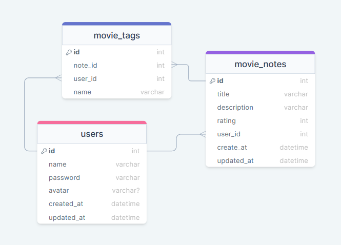

# Movienotes API

Uma aplicação em Node.js onde o usuário cadastra filmes, preenche com algumas informações (nome, descrição, nota) e cria tags de categorias relacionadas a ele (comédia, terror, ação etc).


## Documentação da API

### Usuários

#### Cadastro de usuário

```http
  POST /users
```

| Parâmetro   | Tipo       | Descrição                           |
| :---------- | :--------- | :---------------------------------- |
| `name` | `string` | nome do usuário (**Obrigatório**)|
| `email` | `string` | e-mail do usuário (**Obrigatório**)|
| `password` | `string` | senha do usuário (**Obrigatório**)|

> Formato body JSON


#### Alteração de usuário

```http
  PUT /users/${id}
```

| Parâmetro   | Tipo       | Descrição                           |
| :---------- | :--------- | :---------------------------------- |
| `id` | `integer` | ID do usuário que será alterado |
| `name` | `string` | nome do usuário |
| `email` | `string` | email do usuário |
| `password` | `string` | senha do usuário (**Obrigatório** em caso de nova senha)  |
| `new_passuord` | `string` | nova senha do usuário |


### Filmes

#### Cadastro de Filmes

```http
  POST /movies/${id}
```

| Parâmetro   | Tipo       | Descrição                                   |
| :---------- | :--------- | :------------------------------------------ |
| `id`      | `integer` | ID do usuário |
| `title`      | `string` | títilo do filme  |
| `description`      | `string` | descrição do filme |
| `rating`      | `integer` | Avaliação: valor entre 0 e 5  |
| `tags`      | `string[]` | marcação de categoria (ação, comédia...) |


## Rodando localmente

Clone o projeto

```bash
  git clone https://github.com/dam450/movienotes-api.git
```

Entre no diretório do projeto

```bash
  cd movienotes-api
```

Instale as dependências

```bash
  npm install
```

Execute as migrations

```bash
  npm run migrate
```

Inicie o servidor

```bash
  npm run start
```

### Teste da API com Insomnia

Configuração de rotas do [Insomnia](./insomnia/Insomnia_config).
## Documentação

Diagrama do banco de dados:


